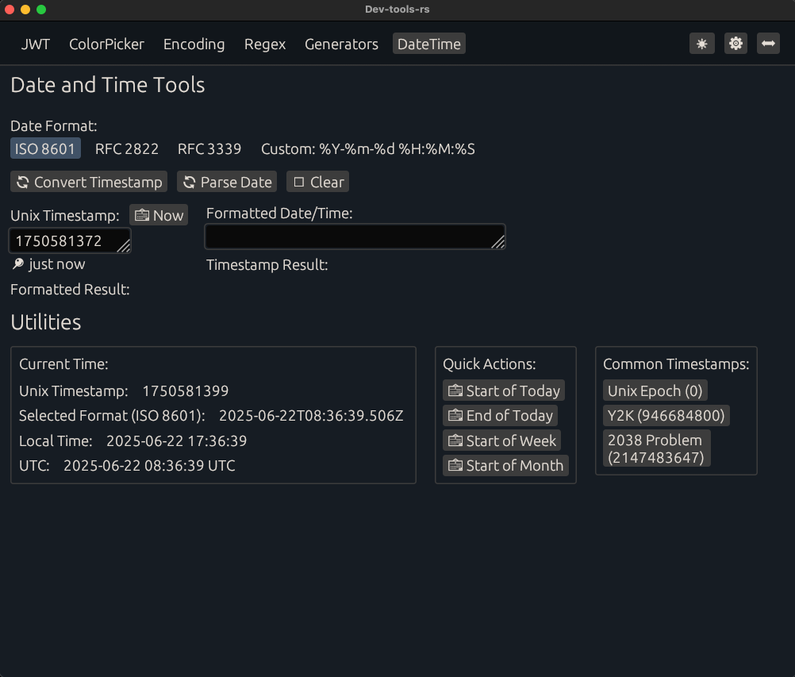

# Dev-tools-rs

A **native application** inspired by the [Developer Tools IntelliJ Plugin](https://plugins.jetbrains.com/plugin/21904-developer-tools), built with **Rust** and **egui**.



---

## Features

Some of these features are work in progress.

- **Color Picker**  
  Easily pick colors and copy their values.

- **Encoding and Decoding**

  - JWT (JSON Web Tokens)
  - Base32, Base64, URL Base64, MIME Base64
  - URL encoding

- **Cryptography**

  - AES, DES, TDES and more
  - RSA, ECDSA

- **Image Tools**

  - Image Resizer
  - Image Format Converter
  - Image Metadata Viewer

- **Text Utilities**

  - Regular Expression Matcher
  - UUID, ULID, Nano ID, and Password Generator
  - Text Sorting
  - Text Case Transformation
  - Text Diff Viewer
  - Text Format Conversion
  - Text Filter

- **JSON Tools**

  - JSON Path Parser
  - JSON Schema Validator

- **Hashing Tools**  
  Generate hashes using various algorithms.

- **Date and Time Handling**

  - Unix Timestamps
  - Formatting and conversions

- **Unit Converters**

  - Time
  - Data Size
  - Transfer Rates

- **Lorem Ipsum Generator**  
  Quickly generate placeholder text for your projects.

---

## Installation

### Pre-built Binaries

Download the latest release from the [Releases](https://github.com/chojs23/dev-tools-rs/releases) page:

- **macOS (Intel)**: `dev-tools-rs-x86_64-apple-darwin.tar.gz`
- **macOS (Apple Silicon)**: `dev-tools-rs-aarch64-apple-darwin.tar.gz`
- **Linux (x86_64)**: `dev-tools-rs-x86_64-unknown-linux-gnu.tar.gz`
- **Windows (x86_64)**: `dev-tools-rs-x86_64-pc-windows-msvc.zip`

#### macOS/Linux Installation

```bash
# Extract the archive
tar -xzf dev-tools-rs-*.tar.gz

# Make executable (if needed)
chmod +x dev-tools-rs

# Run the application
./dev-tools-rs
```

#### Windows Installation

```powershell
# Extract the zip file
# Run the application
.\dev-tools-rs.exe
```

### Building from Source

Ensure you have Rust installed on your system.

```bash
git clone https://github.com/chojs23/dev-tools-rs.git
cd dev-tools-rs
cargo build --release
```

The compiled binary will be available in `target/release/`.

---

### Build from Source

#### Prerequisites

- **Rust**: Version 1.70.0 or later

#### Installation Steps

1. **Install Rust**

   If you don't have Rust installed, install it via [rustup](https://rustup.rs/):

   ```bash
   curl --proto '=https' --tlsv1.2 -sSf https://sh.rustup.rs | sh
   source ~/.cargo/env
   ```

2. **Clone the Repository**

   ```bash
   git clone https://github.com/chojs23/dev-tools-rs.git
   cd dev-tools-rs
   ```

3. **Build the Application**

   For development build:

   ```bash
   cargo build
   ```

   For optimized release build:

   ```bash
   cargo build --release
   ```

4. **Run the Application**

   From development build:

   ```bash
   cargo run
   ```

   From release build:

   ```bash
   ./target/release/dev-tools-rs
   ```

#### Platform-Specific Notes

- **macOS**: No additional dependencies required
- **Linux**: You may need to install development packages:

  ```bash
  # Ubuntu/Debian
  sudo apt update
  sudo apt install build-essential pkg-config libfontconfig1-dev

  # Fedora/RHEL
  sudo dnf install gcc pkg-config fontconfig-devel

  # Arch Linux
  sudo pacman -S base-devel pkg-config fontconfig
  ```

- **Windows**: Make sure you have the Microsoft C++ Build Tools installed

## Usage

Launch the app and select the desired tool from the main menu.

## License

This project is licensed under the MIT License - see the [LICENSE](LICENSE) file for details.
